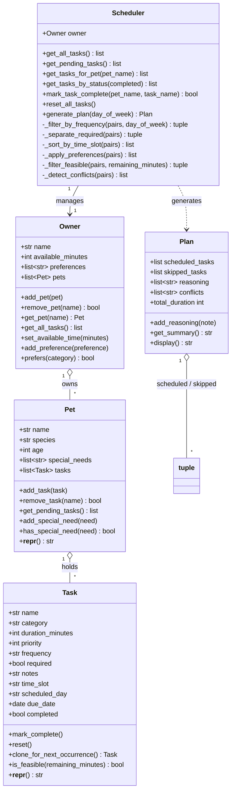

# PawPal+ System Design — Object Brainstorm

## Owner

Represents the person caring for the pet.

**Attributes:**
- `name: str`
- `available_minutes: int` — total time per day they can spend on pet care
- `preferences: list[str]` — preferred task categories (e.g., "walk", "feeding")

**Methods:**
- `set_available_time(minutes)` — update daily time budget
- `add_preference(preference)` — add a scheduling preference
- `prefers(category) -> bool` — check if a category matches any preference

> **Note:** `preferences` is consumed by `Scheduler._apply_preferences()` to boost matching tasks within the same priority tier, with shorter tasks further preferred to maximise fit.

---

## Pet

Represents the animal being cared for.

**Attributes:**
- `name: str`
- `species: str`
- `age: int`
- `special_needs: list[str]` — e.g., "diabetic", "senior", "anxious"
- `tasks: list[Task]` — the pet's own task list

**Methods:**
- `add_task(task)` — append a task to this pet's list
- `remove_task(name) -> bool` — remove by name; returns `False` if not found
- `get_pending_tasks() -> list[Task]` — tasks not yet completed
- `add_special_need(need)` — register a special care requirement
- `has_special_need(need) -> bool` — check if a need applies (case-insensitive)
- `__repr__() -> str` — e.g., `"Buddy (dog, age 4)"`

---

## Task

Represents a single care activity.

**Attributes:**
- `name: str`
- `category: str` — walk, feeding, meds, grooming, enrichment, etc.
- `duration_minutes: int` — must be > 0
- `priority: int` — 1 (highest) to 5 (lowest); validated on construction
- `frequency: str` — `"daily"` | `"weekly"` | `"as-needed"`; validated on construction
- `required: bool` — if `True`, always scheduled regardless of available time
- `notes: str` — optional context
- `time_slot: str` — `"morning"` | `"afternoon"` | `"evening"` | `"any"` (default); controls display order and conflict detection
- `scheduled_day: str` — lowercase weekday (e.g., `"monday"`); only used when `frequency="weekly"`
- `due_date: date` — calendar date this occurrence is due; defaults to `date.today()` on construction
- `completed: bool` — set by `mark_complete()`; cleared by `reset()`

**Methods:**
- `mark_complete()` — mark as done for the current day
- `reset()` — clear completion status (e.g., at start of new day)
- `clone_for_next_occurrence() -> Task | None` — returns a fresh, incomplete copy scheduled for the next occurrence using `timedelta` (`+1 day` for daily, `+7 days` for weekly); returns `None` for `as-needed` tasks which never auto-recur
- `is_feasible(remaining_minutes) -> bool` — `True` if `duration_minutes <= remaining_minutes`
- `__repr__() -> str` — e.g., `"[P1] Morning Walk (30 min, daily, morning, due 2026-03-31) [REQUIRED]"`

> **Scheduling contract:** `required` tasks are always included before any feasibility check. `as-needed` tasks are never auto-scheduled — they must be added manually.

---

## Scheduler

The core engine that retrieves, organises, and schedules tasks across all pets.

**Attributes:**
- `owner: Owner`

**Task access methods:**
- `get_all_tasks() -> list[tuple[Pet, Task]]` — every (pet, task) pair
- `get_pending_tasks() -> list[tuple[Pet, Task]]` — incomplete tasks only
- `get_tasks_for_pet(pet_name) -> list[tuple[Pet, Task]]` — filter by pet name
- `get_tasks_by_status(completed) -> list[tuple[Pet, Task]]` — filter by completion state
- `mark_task_complete(pet_name, task_name) -> bool` — mark a task done and automatically add the next occurrence to the pet's task list (via `clone_for_next_occurrence()`); `False` if not found
- `reset_all_tasks()` — clear completion on all tasks (call at day start)

**Plan generation:**
- `generate_plan(day_of_week="") -> Plan` — full scheduling pipeline; pass e.g. `"monday"` to activate recurring-task filtering

**Private helpers (pipeline order):**
1. `_filter_by_frequency(pairs, day_of_week)` — exclude `as-needed` always; exclude `weekly` tasks whose `scheduled_day` doesn't match today
2. `_separate_required(pairs)` — split into `(required, optional)`
3. `_sort_by_time_slot(pairs)` — order morning → afternoon → evening → any, then by priority
4. `_apply_preferences(pairs)` — within each `(slot, priority)` tier, preferred categories first, then shorter tasks first
5. `_filter_feasible(pairs, remaining_minutes)` — greedy fill; **continues past skipped tasks** so shorter later tasks can still fit
6. `_detect_conflicts(pairs)` — checks scheduled set for slot overruns and required-task collisions

> **Budget guard:** if required tasks alone exceed `available_minutes`, all optional tasks are immediately moved to `skipped_tasks` and the optional pipeline is bypassed.

---

## Plan

The output of a scheduling run.

**Attributes:**
- `scheduled_tasks: list[tuple[Pet, Task]]` — ordered by time slot, then priority
- `skipped_tasks: list[tuple[Pet, Task]]` — tasks that didn't fit or were excluded
- `reasoning: list[str]` — per-decision explanation notes with live remaining-budget values
- `conflicts: list[str]` — slot overrun and required-collision warnings

**Computed property:**
- `total_duration -> int` — sum of `duration_minutes` for scheduled tasks; derived, not stored

**Methods:**
- `add_reasoning(note)` — append an explanation note
- `get_summary() -> str` — e.g., `"6 task(s) scheduled (90 min); 1 skipped; 3 conflict(s) detected"`
- `display() -> str` — full formatted output: scheduled tasks, skipped tasks, conflicts, reasoning, summary

---

## Conflict Detection

`Scheduler._detect_conflicts` scans the **final scheduled set** for three classes of issue, evaluated in this order. All conflicts are returned as plain warning strings — no exceptions are raised.

| # | Conflict type | Trigger | Recommended slot budgets |
|---|---|---|---|
| 1 | **Same-pet slot overlap** | A single pet has two or more tasks assigned to the same named slot (a pet can only do one thing at a time) | Any named slot |
| 2 | Slot overrun | Total scheduled minutes across all pets in a named slot exceeds the slot budget | morning: 45 min, afternoon: 30 min, evening: 30 min |
| 3 | Required collision | Two or more required tasks share the same named slot | Any named slot |

Conflicts are stored in `Plan.conflicts` and surfaced in `plan.display()` under **Conflicts Detected**.

---

## Recurring Task Rules

| `frequency` | `scheduled_day` | Behaviour in `generate_plan(day_of_week)` |
|---|---|---|
| `"daily"` | ignored | Always included |
| `"weekly"` | e.g. `"monday"` | Included only when `day_of_week` matches `scheduled_day` |
| `"as-needed"` | ignored | Always excluded from auto-scheduling |

---

## UML Class Diagram

