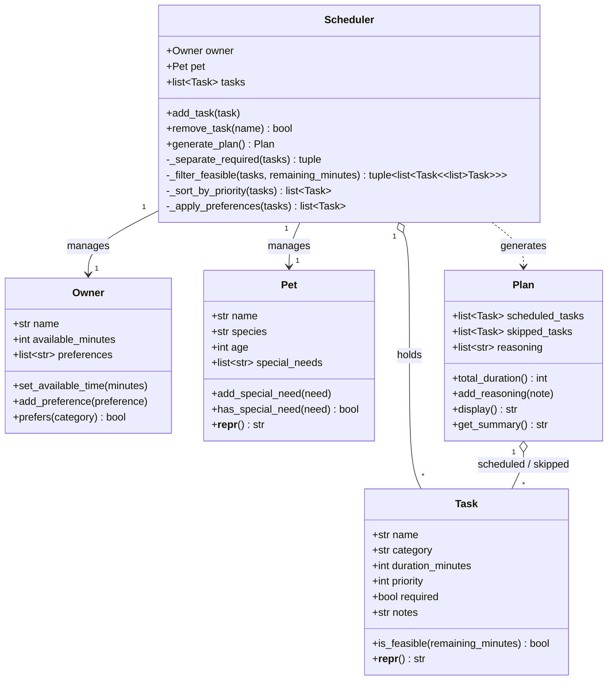
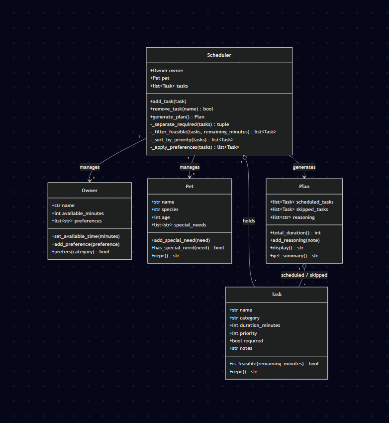

# PawPal+ System Design — Object Brainstorm

## Owner

Represents the person caring for the pet.

**Attributes:**
- `name: str`
- `available_minutes: int` — total time per day they can spend on pet care
- `preferences: list[str]` — preferred task categories (e.g., "morning walk", "evening meds")

**Methods:**
- `set_available_time(minutes)` — update daily time budget
- `add_preference(preference)` — add a scheduling preference
- `prefers(category) -> bool` — check if a category matches any preference

> **Note:** `preferences` must be consumed by `Scheduler._apply_preferences()` to influence task ordering; otherwise this field has no effect.

---

## Pet

Represents the animal being cared for.

**Attributes:**
- `name: str`
- `species: str`
- `age: int`
- `special_needs: list[str]` — e.g., "diabetic", "senior", "anxious"

**Methods:**
- `add_special_need(need)` — register a special care requirement
- `has_special_need(need) -> bool` — check if a need applies
- `__repr__() -> str` — human-readable summary (e.g., `"Buddy (dog, age 4)"`)

---

## Task

Represents a single care activity.

**Attributes:**
- `name: str`
- `category: str` — walk, feeding, meds, grooming, enrichment, etc.
- `duration_minutes: int` — must be > 0
- `priority: int` — 1 (highest) to 5 (lowest); validated on set
- `required: bool` — if `True`, always scheduled regardless of available time
- `notes: str` — optional context

**Methods:**
- `is_feasible(remaining_minutes) -> bool` — returns `True` if `duration_minutes <= remaining_minutes`
- `__repr__() -> str` — e.g., `"[P1] Walk (30 min) [REQUIRED]"`

> **Bug fix:** `required` tasks must be handled before feasibility filtering in `Scheduler` — they cannot be dropped even if they exceed the time budget.

---

## Scheduler

The core engine that turns tasks + constraints into a plan.

**Attributes:**
- `owner: Owner`
- `pet: Pet`
- `tasks: list[Task]`

**Methods:**
- `add_task(task)` — register a task
- `remove_task(name) -> bool` — remove by name; returns `False` if not found (no exception)
- `generate_plan() -> Plan` — run scheduling logic and return a plan
- `_separate_required(tasks) -> tuple[list[Task], list[Task]]` — split into `(required, optional)`
- `_filter_feasible(tasks, remaining_minutes) -> tuple[list[Task], list[Task]]` — returns `(feasible, skipped)`; drop optional tasks that don't fit
- `_sort_by_priority(tasks) -> list[Task]` — order by priority ascending, then by owner preference match
- `_apply_preferences(tasks) -> list[Task]` — boost tasks matching `owner.preferences` within same priority tier

> **Scheduling contract:** required tasks are always included first; optional tasks fill remaining time by priority.

---

## Plan

The output of a scheduling run.

**Attributes:**
- `scheduled_tasks: list[Task]` — ordered list of tasks to complete
- `skipped_tasks: list[Task]` — optional tasks that didn't fit in available time
- `reasoning: list[str]` — human-readable explanation of scheduling decisions

**Computed property:**
- `total_duration -> int` — sum of `t.duration_minutes` for `t` in `scheduled_tasks`; derived, not stored, to stay in sync

**Methods:**
- `add_reasoning(note)` — append an explanation note
- `display() -> str` — full formatted plan for the UI (task list + reasoning)
- `get_summary() -> str` — one-line overview: `"5 tasks scheduled (120 min); 2 skipped"`

---

## UML Class Diagram

